# Module 03: Geospatial processing with Turf.js

Module 03 introduces you to Turf.js, a JavaScript library designed for advanced geospatial analysis and data manipulation. You'll learn how to employ Turf's API within client and server environments. After an introduction to Turf, Assignment 05 guides you through two mapping processes: one emphasizing the use of Turf.js within the browser and another more processor-demanding one run with Node on your local server. Along the way, you'll learn about some more fun mapping technologies and continue to practice your Git, Node, npm, and web cartography skills.

The module's collaborative Assignment 06 challenges you and your class team members to contribute to a shared GitHub repositories of small examples using Turf to accomplish GIS and mapping tasks.

<!-- TOC depthFrom:2 -->

- [Assignment 05: Geoprocessing with Turf.js](#assignment-05-geoprocessing-with-turfjs)
  - [Why Turf is wonderful](#why-turf-is-wonderful)
  - [Part I. Using Turf in the Browser](#part-i-using-turf-in-the-browser)
    - [Setting up your project](#setting-up-your-project)
    - [Getting and converting the data](#getting-and-converting-the-data)
    - [Maptime Turf!](#maptime-turf)
    - [Loading and converting topojson with D3 modules](#loading-and-converting-topojson-with-d3-modules)
    - [Forward geocoding with Mapbox Search API](#forward-geocoding-with-mapbox-search-api)
    - [Using Turf to do a Point-in-Polygon analysis](#using-turf-to-do-a-point-in-polygon-analysis)
    - [Deliverables for Part I](#deliverables-for-part-i)
  - [Part II. Using Turf to perform client-side geospatial analysis](#part-ii-using-turf-to-perform-client-side-geospatial-analysis)
    - [Installing the npm packages](#installing-the-npm-packages)
    - [Processing "big data"](#processing-big-data)
    - [Using the csvtojson npm package](#using-the-csvtojson-npm-package)
    - [Building a hexgrid from 1000s of points](#building-a-hexgrid-from-1000s-of-points)
    - [Maptime hex!](#maptime-hex)
    - [Deliverable for Part II](#deliverable-for-part-ii)
- [Assigment 06: Collaborative Geoprocessing in Turf.js](#assigment-06-collaborative-geoprocessing-in-turfjs)

<!-- /TOC -->

## Assignment 05: Geoprocessing with Turf.js

First, what is Turf? If we direct our browser to the http://turfjs.org/ website, it informs us that Turf offers:

> Advanced geospatial analysis for browsers and Node.js

We've learned that QGIS is in part powered by a library known as GDAL/OGR, written in the low-level languages of C and C++. You may also know that [Python](https://www.python.org/) is an essential language in the GIS and mapping world. We haven't spent time learning Python in New Maps Plus, but you should keep Python in mind as a valuable resource and one you can feel comfortable taking on with your growing GIS and programming skills.

However, as we've seen now in MAP675, there is an increasing number of useful libraries and tools we can use in a JavaScript and Node environment. Turf is one of the more exciting additions to the community-supported suite of geospatial solutions. It began as a personal project by [Morgan Herlocker](http://morganherlocker.com/) in 2013 and has been co-managed by many developers at [Mapbox](https://blog.mapbox.com/turf-gis-for-web-maps-314ab06127a) and across the geospatial community since 2014. A [major release to Turf 5.0](https://github.com/Turfjs/turf/issues/1082) in November of 2017 introduced new modules, feature enhancements, and bug fixes.

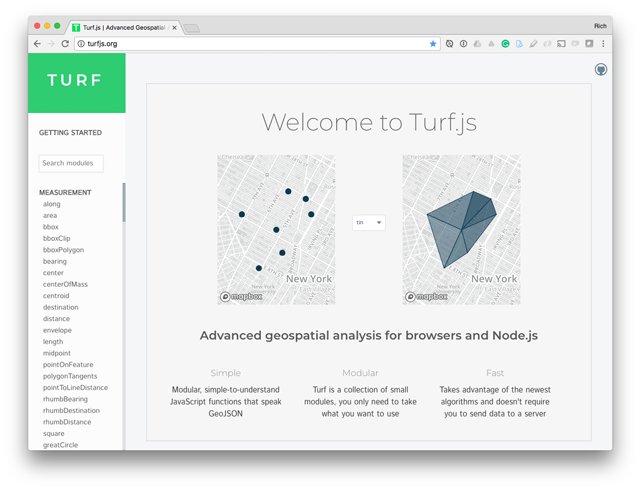  
**Figure 01.** The Turf website at http://turfjs.org.

Like most of the open source projects available to us, Turf is also hosted on GitHub (https://github.com/Turfjs/turf).

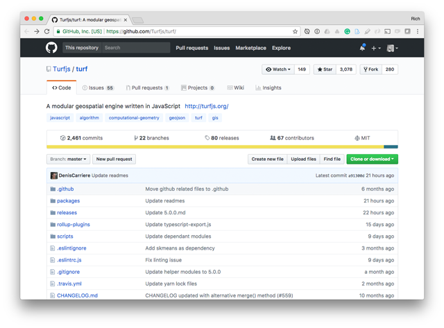  
**Figure 02.** The Turf project hosted on GitHub.

At this point, understanding GitHub-hosted projects should be becoming more familiar to you. For instance, you can see that the contributors to the Turf project collaboratively manage it using Git and npm.

We know this because we can see the [_package.json_ file](https://github.com/Turfjs/turf/blob/master/package.json), which manages various npm dependencies and packages. There's also a [.gitignore](https://github.com/Turfjs/turf/blob/master/.gitignore), which is why we don't see the _node_modules_ directory hosted on the GitHub site. If you wanted to, you could clone down the Turf repository and use the `npm install` command to create the _node_modules_ directory and install the npm packages into it, thereby gaining full access to the development and build processes of the project.

Also crucial are the [Issues](https://github.com/Turfjs/turf/issues) posted for the project. These can be a good source for finding answers to nagging problems you may experience when using Turf. It's sometimes useful to look through the closed issues as well, as people will have pasted code for solutions when asking or answering questions.

A good place to start is the [Getting Started](http://turfjs.org/getting-started) page on the website, which briefly introduces how to use it in the browser and Node.

### Why Turf is wonderful

Before we dive into some mapping processes using Turf, let's run through a few things that make it an excellent tool for us to learn and use.

**1. Did web mention JavaScript!?**

Learning new tools and languages always takes time, and we want our investment to pay off. New Maps Plus hedged our bets with JavaScript mapping libraries and frameworks, and so far the gamble appears to be a good one. JavaScript continues to advance as a language (with ES6), the Node framework allows us to harness the power thousands of JS scripts for various needs, and now Turf gives us a nearly full-fledged GIS we can run simply by writing JavaScript scripts.

**2. GeoJSON in and GeoJSON out**

Turf is written to accept GeoJSON as inputs and output GeoJSON. Support for GeoJSON is advantageous because of the interoperability of the format across the mapping world and our various tools and processes.

**3. Plays well with Leaflet, Mapbox, OpenLayers, D3**

Turf's JavaScript API and insistence on only processing GeoJSON files means it fits in very well with our existing mapping ecosystem. So while we can use it as purely a GIS library without data visualization, it plays well with our favorite mapping tools.

**4. Modularity**

As our web development improves, we move toward the practice of breaking big pieces of software into many small modules. Modularity is its own topic for discussion, but modules allow us to reuse code more efficiently and isolate part of a code collection for use within a project.

For instance, if we head over to see [Turf's @turf/turf npm-hosted site](https://www.npmjs.com/package/@turf/turf), we note that Turf itself has many dependencies.

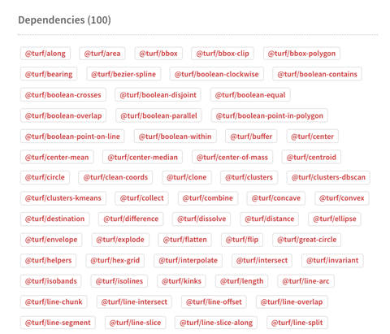  
**Figure 03.** Turf's npm dependencies.

Currently, the "Turf" library is dependent on 100 small modules (and counting) to do such things as [convert a set of points into a concave hull](https://www.npmjs.com/package/@turf/concave) polygon or [cluster points using a k-means algorithm](https://www.npmjs.com/package/@turf/clusters). Turf supports a wide array of methods for spatial interpolation and analysis.

One can either load the entire suite of Turf modules or use them independently to solve particular problems. Individual modules are available as Turf methods, listed [here along the left side of the excellent API documentation](http://turfjs.org/docs).

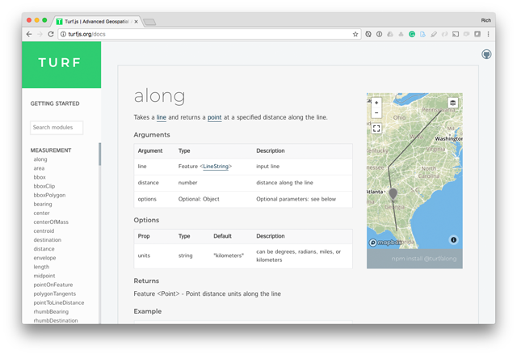  
**Figure 04.** Turf's methods listed in the excellent API documentation.

You should now spend some time perusing the API and considering the methods at your disposal when using Turf. Think about the GIS tasks you're required to do for your work or other classes and how you can incorporate Turf's methods into your existing workflow. In fact, this is what your [collaborative assignment will ask you to explore for this module](assignment-06/)!

**5. Open Source**

Another cool aspect of Turf is that, unlike some of Mapbox's other products, we don't need an API key to use it. Just load it into your script or install it with npm and you're ready to go!

Another example of the remarkable potential of Turf is [Dropchop](http://dropchop.io/). It's more of a proof-of-concept for web-based GIS (and not under rapid development currently), but it uses Turf under the hood to perform many tasks we'd typically fire up ArcGIS or QGIS to complete.

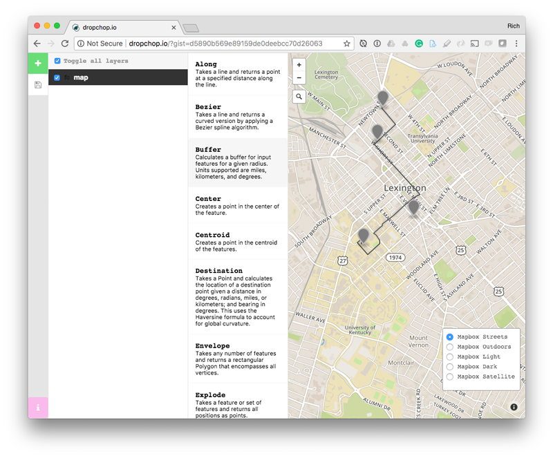  
**Figure 05.** Web-based GIS with the help of Turf-powered Dropchop.

Alright, let's do some mapping with Turf!

### Part I. Using Turf in the Browser

We're going to start by playing with Turf by loading it into our client browser and running the JavaScript when the page loads (just like we do with Leaflet, JQuery, D3, etc). We're not going to exhaustively cover all of Turf's methods with examples, obviously. Instead, we want to get a sense of what's possible so we can become inspired and experiment more in the collaborative assignment and on our own.

We want to be playful with this map and introduce a couple of other fresh solutions as well, beyond Turf. Here's a quick roadmap where we're heading:

On the frontend, we're building a map that accomplishes the following:

* loads a US counties map in TopoJSON format and draws the geometries as a Leaflet L.geoJson layerGroup
* allows the user to search for an address, which
* upon selection of a street address:
    * returns a forward geocoded lat/lon coordinates, a GeoJSON representation of a point feature at that location
    * plots a Leaflet marker at the location of the geocoded search and opens a popup with the place name
* the script then uses Turf to do a point-in-polygon test to determine which county the point lies in
* the map flies to the bounds of this polygon
* the script then uses Turf to:
    * find the centroid of the county polygon, and
    * calculate the distance between the address point and the centroid, and finally
    * creates a new marker at the centroid location and display a tooltip indicating how far the two points lie from one another in miles

This is perhaps not the most burning of critical GIS/mapping tasks to accomplish, but we'll get our feet wet using the Turf API and a sense of how to use the many methods/modules it supports.

But first, we need to set up our project and process some data with which we can map.

#### Setting up your project

You don't need to create a new repository on your GitHub account for this lesson. Rather, work within your _map675-module-03-username/_ project directory generated for you by GitHub Classroom and hosted on the _https://github.com/newmapsplus/_ account.

This repository is already Git-enabled, so you don't need to install Git (just remember to add/commit/push your work occasionally and when appropriate). We'll be working with Node and npm in the Part II of the Assignment 05 and will install npm then.

Create a new directory in the project for housing all the project files we'll use in data processing. Create a new directory named _project-files/_:

```bash
mkdir project-files
```

I prefer to keep the files used for data processing separate than a _data/_ directory, which we'll create in a bit and reserve for the files used by our application (i.e., requested by the HTML/JS/Node app).

Let's now get started with the frontend map.

#### Getting and converting the data

For this map, we want some simple US Counties boundary files. The goto for this, as usual, is [Cartographic Boundary Shapefiles from the US Census](https://www.census.gov/geo/maps-data/data/cbf/cbf_counties.html). Since we'll be simplifying the polygons even more than they already are, the 20 resolution is likely adequate for our purposes.

We can either download the [zipped Shapefile](http://www2.census.gov/geo/tiger/GENZ2016/shp/cb_2016_us_county_20m.zip) manually into our _project-files/_ directory or use a terminal command:

```bash
$ cd project-files/
$ curl -LOk http://www2.census.gov/geo/tiger/GENZ2016/shp/cb_2016_us_county_20m.zip
```

We can unzip it, either manually or with a `unzip` command:

```bash
$ unzip cb_2016_us_county_20m.zip
Archive:  cb_2016_us_county_20m.zip
  inflating: cb_2016_us_county_20m.shp.ea.iso.xml
  inflating: cb_2016_us_county_20m.shp.iso.xml
  inflating: cb_2016_us_county_20m.shp.xml
  inflating: cb_2016_us_county_20m.shp
  inflating: cb_2016_us_county_20m.shx
  inflating: cb_2016_us_county_20m.dbf
  inflating: cb_2016_us_county_20m.prj
 extracting: cb_2016_us_county_20m.cpg
 ```
 
 In Module 02 we learned about the awesome [Mapshaper package](https://www.npmjs.com/package/mapshaper). I recommended installing it globally on your system using the `-g` flag.

 We can see if we've installed this npm package by issuing the `mapshaper` command with the `-v` flag:

 ```bash
$ mapshaper -v
0.4.56
```

Note that we can upgrade to a newer version of mapshaper or other npm packages by using the same command we use to install them initially (there's no harm if it doesn't need an upgrade):

```bash
$ npm install mapshaper -g
/usr/local/bin/mapshaper-gui -> /usr/local/lib/node_modules/mapshaper/bin/mapshaper-gui
/usr/local/bin/mapshaper -> /usr/local/lib/node_modules/mapshaper/bin/mapshaper
+ mapshaper@0.4.65
updated 1 package in 1.772s
```

With Mapshaper installed, we can use the `-info` flag to get some useful information about these Shapefiles we just downloaded:

```bash
$ mapshaper cb_2016_us_county_20m.shp -info
[info]
Layer 1 *
Layer name: cb_2016_us_county_20m
Records: 3,220
Geometry
  Type: polygon
  Bounds: -179.174265 17.913769 179.773922 71.352561
  Proj.4: +proj=longlat +datum=NAD83
Attribute data
  Field     First value
  AFFGEOID  '0500000US39131'
  ALAND     1140324458
  AWATER       9567612
  COUNTYFP  '131'
  COUNTYNS  '01074078'
  GEOID     '39131'
  LSAD      '06'
  NAME      'Pike'
  STATEFP   '39'
```

Next, we want to convert these Shapefiles into a format more suitable for web mapping (a.k.a. GeoJSON).

Drawing from the [Mapshaper Command Reference](https://github.com/mbloch/mapshaper/wiki/Command-Reference), we can use Mapshaper to convert the _cb\_2016\_us\_county\_20m.shp_ Shapefile into GeoJSON and apply various options to specify this conversion. One thing we know is that we can remove attribute fields to reduce the size of the output file. In this case, we may not need any of the attribute fields (given the somewhat trivial example map we're looking to produce). However, let's retain the NAME and GEOID fields for practice (just in case we want to bind other data to the output file later, for example). We'll do this with Mapshaper's [`-filter-fields` flag](https://github.com/mbloch/mapshaper/wiki/Command-Reference#-filter-fields).

Run the following four commands from within the _project-files/_ directory and examine the output files. The first one just uses Mapshaper's default conversion and retains all the fields. The second three filter the fields for `NAME` and `GEOID` but and the last two simplify the line work to retain different percentages of points:

```bash
$ mapshaper cb_2016_us_county_20m.shp  -o format=geojson counties1.json
$ mapshaper cb_2016_us_county_20m.shp -filter-fields NAME,GEOID -o format=geojson counties2.json
$ mapshaper cb_2016_us_county_20m.shp -filter-fields NAME,GEOID -simplify dp 30% -o format=geojson counties3.json
$ mapshaper cb_2016_us_county_20m.shp -filter-fields NAME,GEOID -simplify dp 15% -o format=geojson counties4.json
```

You can compare the output files by file-size, using the list command with a "list human-readable" flag:

```bash
$ ls -lh
...
-rw-r--r--  1 NewMaps  staff   2.3M May  8 15:42 counties1.json
-rw-r--r--  1 NewMaps  staff   1.9M May  8 15:43 counties2.json
-rw-r--r--  1 NewMaps  staff   1.2M May  8 15:43 counties3.json
-rw-r--r--  1 NewMaps  staff   1.1M May  8 15:43 counties4.json
```

We can see that we've trimmed the file down considerably from 2.3MB to 1.1MB. But what about the quality of the geometries? A visual comparison is also helpful.

You can quickly toss your files up in [http://geojson.io/](http://geojson.io/) for a visual comparison:

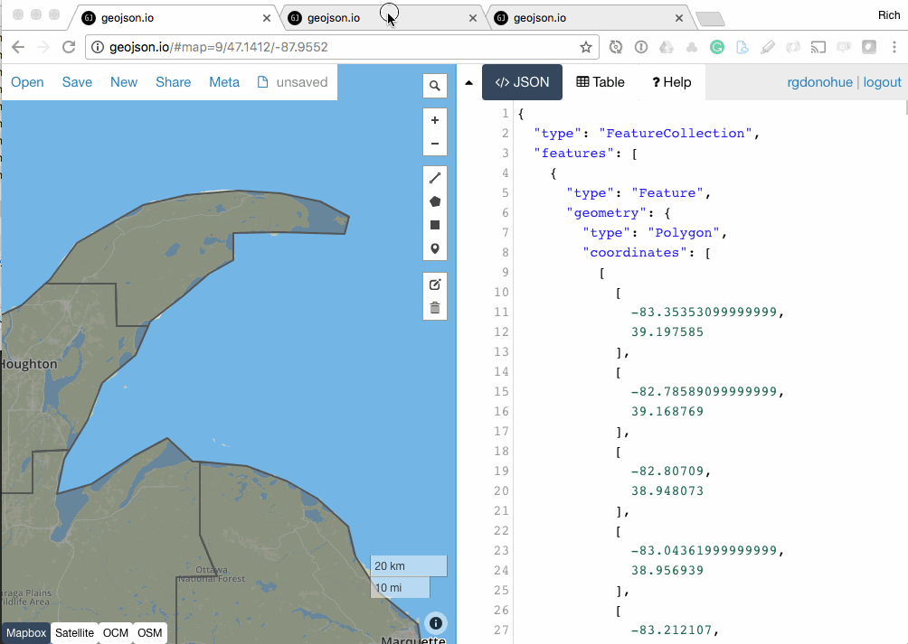  
**Figure 06.** Comparing zero simplification, 30%, and 15% using Douglas-Peucker simplification.

How much to simplify and reduce file size becomes a question of how much of the shape you wish to retain, and for what purpose, given your mapping task. Is losing the character of a recognizable political unit worth saving .3MB? What about 3MB? And of course, it's a question of the map scale you wish to represent.

There are additional parameters you can tweak for further testing. For example, if we include the flag to trim the coordinate precision, we can cut the file size down quite a bit more:

```bash
$ mapshaper cb_2016_us_county_20m.shp -filter-fields NAME,GEOID -simplify dp 15% -o precision=.00001 format=geojson counties5.json
```

Cutting the coordinates down to 5 decimals has no notable change in the shape of the features but drops the size from 1.1MB to 918K. Keep this in mind: trimming coordinate precision can do more to reduce file size than drastically over-simplifying linework.

We can further minimize the size of our file by converting our geographic data to the
 [TopoJSON format](https://github.com/topojson/topojson). You may recall from our lesson in MAP673 on D3.js that the TopoJSON format encodes topology and ends up being a much smaller format than GeoJSON for data transfer.

There are several utilities that convert Shapefiles or GeoJSON to TopoJSON, many of which are [written by the author, Mike Bostock, himself](https://www.npmjs.com/package/topojson). However, Mapshaper also does a great job using the `-o format=topojson` flag and value:

```bash
$ mapshaper cb_2016_us_county_20m.shp -filter-fields NAME,GEOID -simplify dp 15% -o format=topojson counties6.json
```

The result is a TopoJSON file only 586K in size:

```bash
ls -lh
...
-rw-r--r--  1 NewMaps  staff   1.1M May  8 15:43 counties4.json
-rw-r--r--  1 NewMaps  staff   918K May  8 15:45 counties5.json
-rw-r--r--  1 NewMaps  staff   586K May  8 15:45 counties6.json
```

We've successfully converted our Shapefile into a 2.1MB GeoJSON file, and then reduced this to a 586K TopoJSON file while retaining our `NAME` and `GEOID` attribuntes for each feature. Let's call this good for now and move on. Hopefully, your curiosity encourages you to explore more of Mapshaper's options and capacities to process data (there is a lot packed under the hood there!). And keep in mind that we just did some very common GIS processing without even opening QGIS or ArcGIS!

#### Maptime Turf!

Let's get out of our _project-files/_ directory and start setting up the rest of our project to make a web map. Type the following three commands to:

1. move up one level out of _project-files/_ and create a new directory named _data/_
2. move and rename the _counties6.json_ file into the _data/_ directory,
3. create an _index.html_ file at the root level

```bash
cd .. && mkdir data
mv project-files/counties6.json data/counties.json
touch index.html
```

Your project directory structure should now look like this:

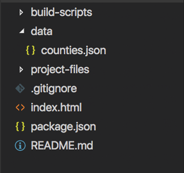  
**Figure 07.** Current state of project directory

Let's get started with a basic template. Because we're going to be using the [Mapbox Search API](https://www.mapbox.com/geocoding/), we're required to use it with a Mapbox map due to the license. You'll want to create an account with Mapbox if you haven't already and [obtain your access token](https://www.mapbox.com/help/define-access-token/).

We'll also be loading and using mapbox.js, an unfortunately not deprecated library that wraps the slightly older Leaflet version 1.0.2 within it. 

**Caution: do not use both leaflet.js/leaflet.css and mapbox.js/mapbox.css together** as it will cause unexpected problems.

Write this code within your _index.html_ file and update it with your access token.

```html
<!doctype html>

<html lang="en">

<head>
  <meta charset="utf-8">

  <title>Module 03 Turf.js</title>
  <link href='https://api.mapbox.com/mapbox.js/v3.1.1/mapbox.css' rel='stylesheet' />

  <style>
    body {
      font-family: sans-serif;
      margin: 0;
      padding: 0;
    }

    #map {
      position: absolute;
      width: 100%;
      top: 0;
      bottom: 0;
    }
  </style>

</head>

<body>
  <div id="map"></div>

  <script src='https://api.mapbox.com/mapbox.js/v3.1.1/mapbox.js'></script>
  <script>
    var map = L.map('map', {
      zoomSnap: .1,
      center: [40.33077, -99.5182],
      zoom: 4.2
    });

    // mapbox access token
    var accessToken = '< your access token >';

    // add mapbox tile layers using access token
    L.tileLayer('https://api.tiles.mapbox.com/v4/{id}/{z}/{x}/{y}.png?access_token=' + accessToken, {
      attribution: 'Map data &copy; <a href="http://openstreetmap.org">OpenStreetMap</a> contributors, <a href="http://creativecommons.org/licenses/by-sa/2.0/">CC-BY-SA</a>, Imagery © <a href="http://mapbox.com">Mapbox</a>',
      maxZoom: 18,
      id: 'mapbox.light',
      accessToken: accessToken
    }).addTo(map);
  </script>
</body>

</html>
```

Launching this boilderplate with a local host server gives us our basic Leaflet/Mapbox basemap:

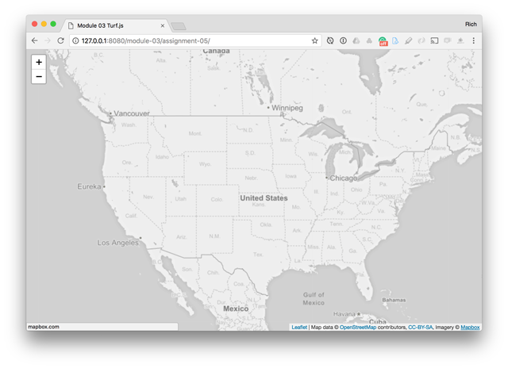  
**Figure 08.** Basic Leaflet map with Mapbox tiles.

Next, let's load the Topojson file we created and draw it to our map.

#### Loading and converting topojson with D3 modules

We wish to request the TopoJSON file (_data/counties.json_), which then needs to be converted from TopoJSON back to GeoJSON within the client so Leaflet can interpret it (see MAP673 Lesson 07). There are various ways to achieve this. We'll use a D3 module, [d3-fetch](https://github.com/d3/d3-fetch) to request the data and the [topojson-client module](https://github.com/topojson/topojson-client/blob/master/README.md#feature) to do this.

First update your _index.html_ file to request the following modules:

```html
<script src="https://d3js.org/d3-fetch.v1.min.js"></script>
<script src="https://unpkg.com/topojson@3"></script>
```

Next we can include the following JavaScript at the bottom of our `<script></script>` tags (after we've created the map and added the L.tileLayer to it). First we can request our data file. D3-fetch reads and parses JSON, GeoJSON, and TopoJSON with the same method:

```javascript
// use d3-fetch to request the topojson
d3.json('data/counties.json')
  .then(function (data) {
    console.log(data); // examine the format. what is it?
  });
```

We can see within the output of a Console statement that we're currently working with TopoJSON. Leaflet can't draw the TopoJSON directly to the map by itself. While there are some plugins to help with this, we don't really need them. Instead, we'll use the topojson-client module to convert the TopoJSON into GeoJSON.

Update your code to get the `data` parameter out of the callback function into a new function named `drawMap()`. We can then do the conversion and draw the GeoJSON data to the map as we normally would:

```javascript
// use d3-fetch to request the topojson
d3.json('data/counties.json')
  .then(function (data) {
    drawMap(data); // send data out of callback to a new function
  });

function drawMap(data) {

  // convert the TopoJSON to GeoJSON
  var geojson = topojson.feature(data, data.objects.cb_2016_us_county_20m);

  // add to our map
  var counties = L.geoJson(geojson, {
    style: function (feature, layer) {
      return {
        color: 'white',
        fillColor: '#448ee4',
        fillOpacity: '.7',
        weight: 1
      }
    }
  }).addTo(map);

} // end drawMap
```

One challenging part in this addition to our script is understanding where we get this: `data.objects.cb_2016_us_county_20m`. 

The `data` is the parameter we've accepted within our `drawMap()` function. But what about the `objects.cb_2016_us_county_20m`? Try searching for `objects` and/or `cb_2016_us_county_20m` within your _data/counties.json_ TopoJSON file.

If all is well, we should see our counties drawn to the map and moderately styled using Leaflet's Path style options:

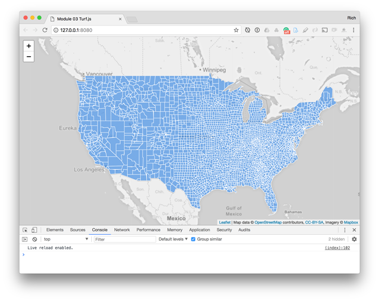  
**Figure 09.** Topojson counties drawn to the map.

We now want to provide the user with a way to search for an address within our app.

#### Forward geocoding with Mapbox Search API

There are various solutions to forward geocoding an address (i.e., deriving latitude and longitude coordinates from an address or place name), some of which are listed among [Leaflet's Plugins](http://leafletjs.com/plugins.html#geocoding).

A company called Mapzen offered a fantastic one that integrated well with Leaflet. Unfortunately, Mapzen folded in early 2018, leaving us with some [migration options for forward geocoding to consider](https://mapzen.com/blog/migration/). The [geocode.earth option from Pelias](https://geocode.earth/) is likely the best, but their current pricing model sits at $200/month.

We'll try using the [Mapbox Search API](https://www.mapbox.com/help/how-geocoding-works/) for our task here. The Mapbox Search API works on a "pay-as-you-go" model but offers some minimal rate limits to get started (600 requests per minute, 50,000 geocode requests/month). The geocoder comes wrapped within the mapbox.js library, so there's no need to request an additional plugin.

With those pieces of the puzzle in place, add the following JavaScript Code to our script (**after we've defined our `accessToken` and between the code that adds the tileLayer to the map and the `d3.json()` request for the data**):

```javascript
// create a geocoder control object with options
var geoCoderControl = L.mapbox.geocoderControl('mapbox.places', {
  accessToken: accessToken,
  keepOpen: true,
  autocomplete: true,
  position: 'topright'
});

// add the geocoder to the map
map.addControl(geoCoderControl)
```

If the geocoder is working, you should now be able to search for addresses. When selecting a result, the geocoder zooms the map to the location.

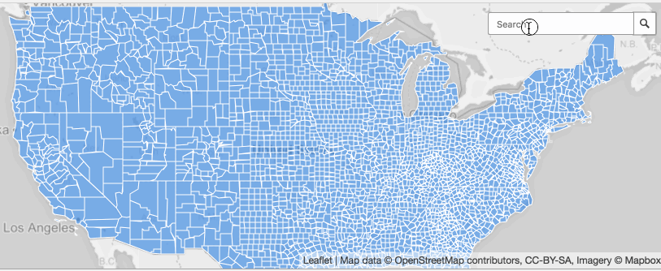  
**Figure 10.** Searching for an address with the geocoder.

Next, within our `drawMap()` function, after we've added our counties layer to the map, we can use one of the geocoder's event listens to determine when we've selected a result.

```javascript
// listen for a selection and then invoke the callback function
geoCoderControl.on('select', function (result) {
  console.log(result)
});
```

The `result` within this callback function provides a lot of information, including feature data returned within a GeoJSON format.

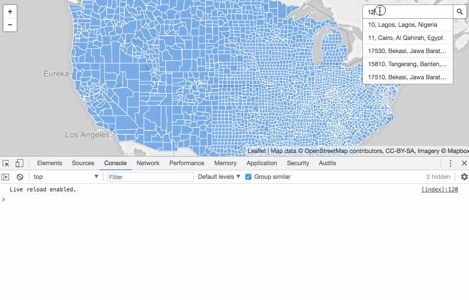  
**Figure 11.** The result of the geocoder search.

Take a moment to explore what information the geocoder returns. This information is impressive. In particular, we're going to use the `result` property to access the `feature` property, which is a GeoJSON representation of the point location. This is handy since Turf and Leaflet love GeoJSON!

#### Using Turf to do a Point-in-Polygon analysis

We're finally ready to get Turf in the browser. First, let's request the resource by adding it to our document:

```html
<script src='https://npmcdn.com/@turf/turf/turf.min.js'></script>
```

Next, replace the `console.log(result)` statement &ndash; within the `geoCoderControl.on('select')` callback function  &ndash; with some code to create a new marker at the search location and open a tooltip with the name/address:

```javascript
// add a marker on the map
var searchResult = L.geoJson(result.feature).addTo(map);

// add and open tooltip
searchResult.bindTooltip(result.feature.place_name).openTooltip();
```

You should see a new Leaflet marker placed at the location.

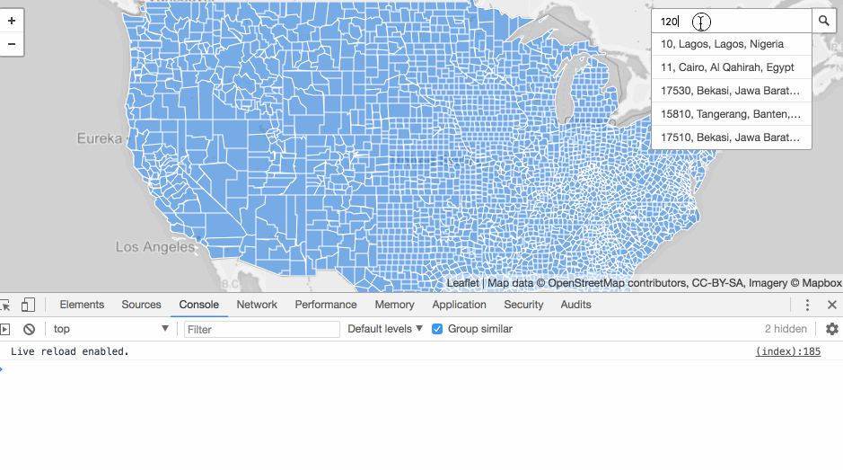  
**Figure 12.** Placing a new marker at the search location.

Next, we want to loop through all our county layers and determine which one our location falls within. To do so, we'll use a point-in-polygon test. Add the following code to your script (within the callback function for the `geoCoderControl.on('select')` method):

```javascript
// loop through the county layers
counties.eachLayer(function (layer) {

  // convert Leaflet layer to geojson with Leaflet toGeoJSON() method
  var polyFeature = layer.toGeoJSON();

  // if the result's feature is inside the polygon
  if (turf.booleanPointInPolygon(result.feature, polyFeature)) {

    // adjust the map pan/zoom to the county layer bounds
    map.flyToBounds(layer.getBounds(), {
      padding: [20, 20]
    });

    // when the map is zooming on the flyTo
    map.on('zoomend', function () {
      layer.setStyle({
        color: '#f0dc00',
        fill: false,
        weight: '3'
      }).bringToFront();

    });
  }
});
```

We're using one of Turf's methods, the `turf.booleanPointInPolygon()` method, which performs a point-in-polygon analysis. We're looping through each county layer, and when the point-in-polygon test is true, we know the point is within a particular county layer. We then use Leaflet's `flyToBounds()` method to zoom that county layer's bounds. When Leaflet's "zoomend" event is triggered, we're changing the style of the layer and bringing it to the top of the other layers.

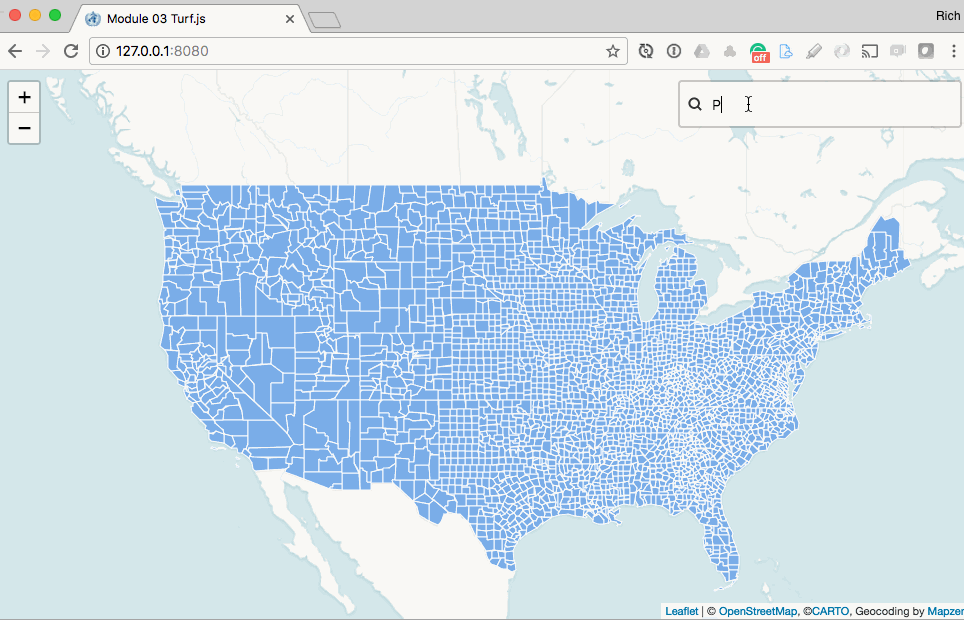  
**Figure 13.** After a such result is returned, using turf.booleanPointInPolygon() to find the county.

Now study the [API documentation for turf.booleanPointInPolygon](http://turfjs.org/docs#booleanPointInPolygon) for a moment to see how it's working (the example should be useful). Test your knowledge: how would you modify the current script to include the optional `ignoreBoundary` property to be `true`? How do we pass the third optional argument for options to the method call?

An important thing to emphasize here is that `layer` references a Leaflet L.GeoJSON representation of the county. But Turf requires GeoJSON. When you're working with Turf and get "`Uncaught Error: No valid coordinates`" error messages, think carefully about the datatype of the object you're providing it. In this case we can NOT write `if (turf.inside(result.feature, layer)) { ...` because again, `layer` is a Leaflet object, not GeoJSON. We **must convert Leaflet objects to GeoJSON for use with Turf's methods.**

Let's practice using Turf for some more tasks before we wrap up this frontend part. Once the map is done zooming into the county, we want to:

1. find the centroid
2. place a maker on the centroid
3. measure the distance between the centroid and address, and 
4. display this information for the user

To do this let's first get the information out of the `map.on('zoomend')` function callback and into another function we write named `findDistanceToCentroid()`.

Call this function below the last line of the callback and send 1. the layer and 2. feature from the search result as arguments:

```javascript
// when the map is zoon zooming on the flyTo
map.on('zoomend', function() {
    layer.setStyle({
        color: '#f0dc00',
        fill: false,
        weight: '3'
    }).bringToFront();

    findDistanceToCentroid(layer, result.feature);
});
```

Next, at the bottom of the script (below the closing `});` of the `geocoder.on()` methods' callback function, declare the function and include the two parameters (renamed here to be different than their arguments in the function call):

```javascript
function findDistanceToCentroid(countyPolygon, searchedFeature) {

    // access to the county layer and address feature here

}
```

Your task for the first part of the lesson is to complete the script to achieve the desired task. In particular you'll want to use the [turf.centerOfMass](http://turfjs.org/docs#centerOfMass) and [turf.distance](http://turfjs.org/docs#distance) methods. The following pseudo-code should help guide you:

```javascript
function findDistanceToCentroid(countyPolygon, searchedFeature) {

    // convert Leaflet county back to GeoJSON

    // use turf.centerOfMass to create a point feature at the centroid

    // use the centroid GeoJSON feature to create a Leaflet marker
    // and add it to the map
    
    // use Turf to determine the distance in miles between the 
    // two markers. Hint: Turf wants GeoJSON!

    // bind the distance info to the centroid marker and open the tooltip
}
```

The map should then behave like this:

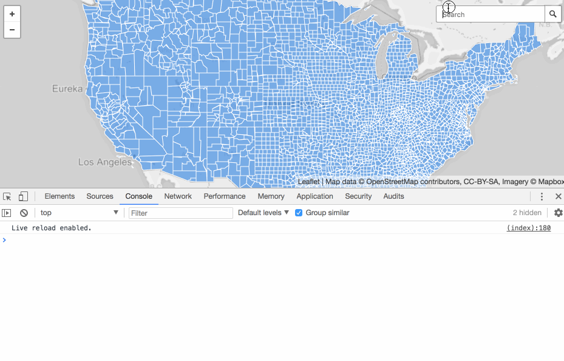  
**Figure 14.** Completed lesson map for using Turf in the browser.

#### Deliverables for Part I

Complete the scripted task just described and add/commit your changes via Git. Also, include the files within the _project-files/_ directory we processed earlier with Mapshaper.

Additional challenges you can consider tackling include:

* Limiting the available search addresses to our target US counties (search the Mapbox docs)
* Reseting the map if the user performs the search more than once
* Thinking of something more interesting to do than measure the distance from the searched location to the county centroid

### Part II. Using Turf to perform client-side geospatial analysis

For Part II we're going to explore running Turf on the server-side, rather than client-side in the browser. There are a couple of reasons for doing this.

The more immediate need to run Turf on the server is that JS runs quite slowly in the browser. This is an unfortunate consequence of using a JavaScript library (though the geogeeks are always improving this).

However, when we run Turf using Node it can run much faster (we won't get into the details of why, but [you can read more about it](https://blog.ghaiklor.com/why-nodejs-is-so-fast-a0ff67858f48)). So, depending on the task at hand, it may be more appropriate to run Turf processing on the server rather than expecting your user to wait a while for the process to end.

The second reason is that when we bring Turf into Node, we can couple it with other useful npm packages. We can then integrate Turf into more robust geoprocessing tool chains. Eventually (we won't be getting into it now), you can use a build tool such as [Browserify](http://browserify.org/) to bundle your npm dependencies in a format that CAN be run in the browser (though colossal geoprocessing tasks will still be too much and should be done server-side).

The second part of the lesson will explore using a couple of Node scripts to process some big data (a 313MB delimited data file). Our goal is to use Turf to prepare this file, so we map the equivalent representation of a hundred thousand plus points on a web map (without the client's browser crashing).

We're making a relatively simple map and using Turf to create a "hexbin" or "hexgrid" map, a favorite technique for representing aggregated data and a suitable alternative to a choropleth.

#### Installing the npm packages

Your project directory within _assignment-05_ has already been initialized with npm, hence the existence of the _package.json_ file. If you look within this file you'll see a number of dependencies:

```javascript
  "dependencies": {
    "@turf/turf": "^5.1.6",
    "chalk": "^2.4.1",
    "csvtojson": "^1.1.9",
    "geojson-validation": "^0.2.0"
  }
```

These are npm packages required by the two scripts with the _build-scripts/_ directory. These two scripts 1. process a CSV file into GeoJSON and 2. convert the extracted points of US church locations into a set of hexagon polygons encoded as GeoJSON.

The _module-03_ directory also already contains a `.gitignore` file ignoring a _node_modules/_ directory when adding/committing using Git. The _node_modules/_ directory does not yet exist within the project, but will in a moment.

You can begin by installing the npm dependencies listed in the _assignment-05/package.json_ file with the `npm install` command (**be sure you've navigated your terminal/command to issue the command from within the _assignment-05/_ directory**).

```bash
npm install
```

This command should download and install npm packages, creating the _node_modules/_ directory as it does, as well as a _package-lock.json_ file.

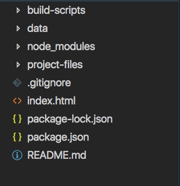  
**Figure 15.** Project directory for starting Part II.

Now we're ready to get some "big data."

#### Processing "big data"

In your browser navigate to https://geonames.usgs.gov/domestic/download_data.htm and download the file named _NationalFile\_20180401.zip_ (all national features in one .zip file).

Save this file to your local hard drive (**but not your _project-files_ directory**). You'll notice it's an 80.7MB .zip file. Unzip it and you'll discover a 313.1MB ile named _NationalFile_20171001.txt_ that contains 2,277,140 records, each with many attribute fields delimited by a `|` symbol. That's a lot of data!

**CAUTION!!:** The _.gitignore_ should be updated to exclude this file as so you don't end up trying to push this enormous file up to GitHub! GitHub won't accept a file this large. **So be careful not to commit this huge file to your Git before you add this line to the_.gitignore_ file and commit this change to the .gitignore file**:

```txt
# Dependency directories
node_modules/

# Large files
project-files/NationalFile_20180401.txt
```

Once you've updated your _.gitignore_ file, **and added and commited this change** add the National_20180401.txt to your _project-files/_ directory.

Our objective now is to extract the 182,497 features with an attribute field `FEATURE_CLASS` of `Church`. How do we go about processing this? Node scripts to the rescue? Let's find out.

#### Using the csvtojson npm package

To help solve the problem of processing such a large file we're going to use an npm package named [csvtojson](https://www.npmjs.com/package/csvtojson). Visit that webpage and read about how it works.

Then examine the contents of the [_build-scripts/process-csv.js_](build-scripts/process-csv.js) file, included with your project. A few notable things:

* Because this is Node, we can practice using ES6 syntax:
    * The use of `const` instead of `var` for variables that the script doesn't redefine as it runs and `let` for variables that it will (such as the `feature` variable).
    * The use of `(jsonObj) =>` syntax for callback functions rather than `function(jsonObj)`. 
* The script uses a Node [fs.readStream](https://nodejs.org/api/fs.html#fs_class_fs_readstream) to help process the huge file. Streaming helps because your computer doesn't need to hold the entire data set in memory while it works.
* We're just using native JavaScript to build our
GeoJSON structure from the delimited data (nothing fancy going on there, though we could employ an npm package such as csv2geojson to do this as well).
* The script uses an npm package called [geojson-validation](https://www.npmjs.com/package/geojson-validation) to valid the GeoJSON structure we build. Validation is nice because without it the file may output an invalid GeoJSON file (e.g., missing a `coordinates` property) which will break in applications or processes later on.
* The output GeoJSON is large (25.8MB), and while we can use Node fs writeStreams for output as well, we likely don't need one in this case.
* The script uses what's known as a [modulo operator](https://developer.mozilla.org/en-US/docs/Web/JavaScript/Reference/Operators/Arithmetic_Operators) to only log to console every 100,000th row: `if((i % 100000) == 0) `. If when we divide `i` by 100,000, the remainder is zero and we log to console. Note that the console.log statements may slow the script down a bit as it runs, but it's nice to see that it's working rather than sitting there waiting for the script to finish.

**Important note**: This script utilizes what's known as "worker processes" for multi-core processing and may strain older systems. Try closing other applications before running. If the process takes more than ~10 minutes to complete or starts to catch your computer on fire, contact your instructor for a copy of the output file so you can move onto the next script.

From the _module-03/_ directory:

```bash
node build-scripts/process-csv.js
```

The script will likely run for a while before you see your first output. If successful, you'll see some output in the console indicating the total processing time, validation of the GeoJSON, and the final console message.

```bash
$ node process-csv.js
...
testing row #: 900000
testing row #: 1000000
testing row #: 1100000
testing row #: 1200000
testing row #: 1300000
testing row #: 1400000
testing row #: 1500000
testing row #: 1600000
testing row #: 1700000
testing row #: 1800000
testing row #: 1900000
processing time: : 66903.112ms
this is valid GeoJSON!
182497 features created.
done writing file
```
You may need to Ctr+C once the process is done to return to the command cursor. Furthermore, you should have a _churches.json_ file now saved within the _project-files/_ directory.

We now have a GeoJSON of point data containing 182,497 features. That's still a lot of data! We can even throw it into QGIS to inspect:

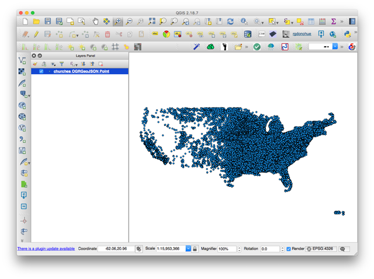  
**Figure 16.** The output churches.json GeoJSON file in QGIS.

Now let's create a hexagon GeoJSON file from all these points.

#### Building a hexgrid from 1000s of points

Next, we want to explore the second script in your _build-scripts/_ directory, the _create-hex.js_ Node script.

We're going to use Turf to achieve two things within this script:

1. We'll use Turf's [turf.hexGrid()](http://turfjs.org/docs#hexGrid) method to create a set of polygons over a given bounding box, each of the same size
2. We'll again use Turf's [turf.booleanPointInPolygon()](http://turfjs.org/docs#booleanPointInPolygon) method to do a point-in-polygon analysis to determine how many points exist within each polygon

Additionally, we can use one of Turf's methods ([turf.featureEach](http://turfjs.org/docs#featureEach))to loop through our features in a similiar way as JavaScript's `forEach()` method loops through an array or Leaflet's `eachLayer()` method loops through a L.layerGroup() object.

We'll also use the [turf.trucate()](http://turfjs.org/docs#truncate) method to trim the coordinate precision of our output GeoJSON file (in a similar way we used Mapshaper's `precision` option).

Examine the full [build-scripts/create-hex.js](build-scripts/create-hex.js) and read the comments to better understand how it's running.

We're using the core `fs` module to read the _/project-files/churches.json_ file into the script and to write our output to _/data/hexgrid.json_.

Try running the script with Node (again, from within the _project-files/_ directory):

```bash
node build-scripts/create-hex.js
```

The script will run for a while and output how many counts it's tallying for each hex. When finished, you should see some output indicating so and a new _hexgrid.json_ file within the _data/_ directory.

```bash
$ node create-hex.js
adding count of 0 to hex #: 1882
adding count of 0 to hex #: 1883
adding count of 0 to hex #: 1884
adding count of 0 to hex #: 1885
adding count of 0 to hex #: 1886
adding count of 0 to hex #: 1887
adding count of 0 to hex #: 1888
adding count of 0 to hex #: 1889
adding count of 0 to hex #: 1890
ready to write the hexgrid to file
done writing file!
```

Note that the script took a while to run (again, the `console.log()` statements slows it down a bit). We're looping through every one of the 182,497 points for every hexagon, certainly nothing we'd want to do within the client's browser.

Our output file should be a thin 454kb and contain one `count` property for each of the 1890 polygon features: the total number of points that fell within it. Note that once again we can throw our file up onto [geojson.io](http://geojson.io/) to have a quick look at what we've achieved before coding up our Leaflet map:

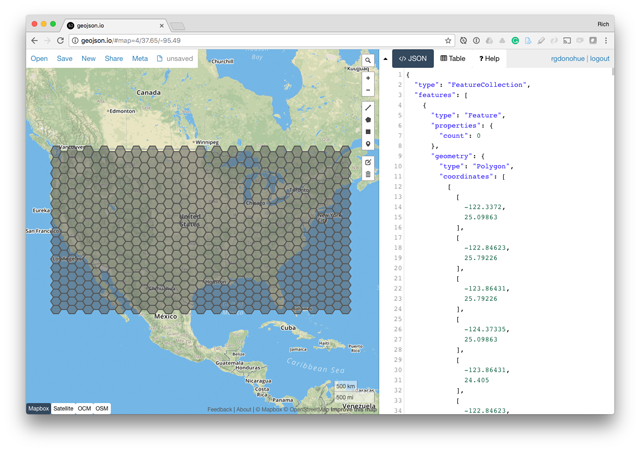  
**Figure 17.** Output hexgrid GeoJSON file in geojson.io.

It looks good. We're ready to make our hex map!

#### Maptime hex!

Let's create a second HTML document for this map. We can call it _hexgrid.html_ or something like that.

```bash
cd ../
touch hexgrid.html
```

Within the _hexgrid.html_ HTML document, start with the following:

```html
<!doctype html>

<html lang="en">

<head>
  <meta charset="utf-8">

  <title>Module 03 Churches Hexgrid</title>
  <link rel="stylesheet" href="https://unpkg.com/leaflet@1.3.1/dist/leaflet.css" />

  <style>
    body {
      font-family: sans-serif;
      margin: 0;
      padding: 0;
    }

    #map {
      position: absolute;
      width: 100%;
      top: 0;
      bottom: 0;
    }
  </style>

</head>

<body>
  <div id="map"></div>

  <script src="https://code.jquery.com/jquery-3.2.1.min.js"></script>
  <script src="https://unpkg.com/leaflet@1.3.1/dist/leaflet.js"></script>
  <script>
    // create Leaflet map, centered on Texas
    var map = L.map('map', {
      zoomSnap: .1,
      center: [40.33077, -99.5182],
      zoom: 4.2
    });

    // add a basemap of tiles
    L.tileLayer('https://cartodb-basemaps-{s}.global.ssl.fastly.net/rastertiles/voyager/{z}/{x}/{y}.png', {
      maxZoom: 18,
      attribution: '&copy; <a href="http://www.openstreetmap.org/copyright">OpenStreetMap</a>, &copy;<a href="https://carto.com/attribution">CARTO</a>'
    }).addTo(map);

    // request our js file
    $.getJSON('data/hexgrid.json', function (data) {

      // draw map
      drawMap(data);
    });

    function drawMap(data) {

      // map options
      var options = {
        // style the hexagons
        style: function (feature, layer) {
          return {
            color: 'white',
            weight: 2,
            fillColor: 'steelblue',
            fillOpacity: 1
          }
        },
        onEachFeature: function (feature, layer) {
          // attach a tooltip to each
          layer.bindTooltip('# of churches: ' + feature.properties.count);
        },
        filter: function (feature) {
          if (feature.properties.count) return feature;
        }
      }

      // create the Leaflet map using the hexgrid geojson data
      L.geoJSON(data, options).addTo(map);
    }
  </script>
</body>

</html>
```

Notice how we're using the Leaflet L.geoJson() method's `filter` property to exclude the hexagons with zero counts from the layerGroup object created.

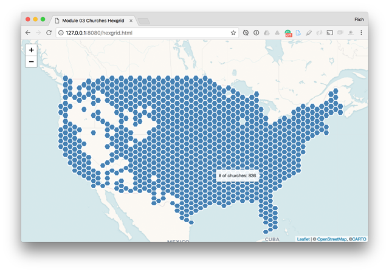  
**Figure 18.** Hex geometries drawn to the map.

**Challenge**: how would you modify the script we used to produce the hexgrid.json file to exclude these polygons and further reduce the file size?

Next, we want to create a choropleth-type map (shade by value) using these hexagons' counts. To do so we first need to classify our data. Typically classifying data involves knowing the full range of our data values so we can determine the distribution and decide on an appropriate classification method (quantile, ckmeans, etc). For this demonstration, we'll revisit the fantastic [Chroma library](http://gka.github.io/chroma.js/).

Add the request for the chroma.min.js file:

```html
<script src="https://cdnjs.cloudflare.com/ajax/libs/chroma-js/1.3.7/chroma.min.js"></script>
```

Next, we need to determine the full range of values from our data so we can apply various classifications schemes using Chroma. We can loop through our incoming GeoJSON data and push all those values to an array. Update the callback function requesting the GeoJSON data and send the resultant `counts` array as a second argument to draw our map:

```javascript
$.getJSON('data/hexgrid.json', function(data) {

    // empty array
    var counts = [];
    // loop through all the hex features
    data.features.forEach(function(feature) {
        // push the count to the array
        if(feature.properties.count > 0) {
            counts.push(feature.properties.count)
        }
    });

    // draw map with data and counts
    drawMap(data, counts);
});
```

Within the `drawMap()` function, we can then create a `colorize` function using various options and parameters available through Chroma.js:

```javascript
function drawMap(data, counts) {

    // use chroma.limits to determine 
    var breaks = chroma.limits(counts, 'k', 9);

    // build a colorize function
    var colorize = chroma
                    .scale('OrRd')
                    .domain(breaks)
                    .mode('lch')
                    .correctLightness();
    // more code below
```

We can then replace with the hardcoded color value for each hex feature with the result returned by the `colorize` function:

```javascript
// style the hexagons with data counts
style: function(feature, layer) {
    return {
        color: 'white',
        weight: 2,
        fillColor: colorize(feature.properties.count),
        fillOpacity: 1
    }
},
```

The result should be a choropleth-type map of church density across the US.

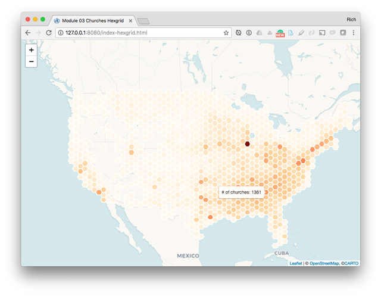  
**Figure 19.** Completed map for Part II.

You should experiment with both the Chroma.js options (read toward the bottom of the document page). Additionally, it should be easy for you to tweak the script creating the hexagons to experiment with different sizes (the script created .5 degree sided hexagons). All you would need to do is re-run the script, producing a new _hexgrid.json_ file, and the map will load the updated output file into the browser.

For example, I can rerun the script using a `cellSide` value of 2 degrees to produce the map: 

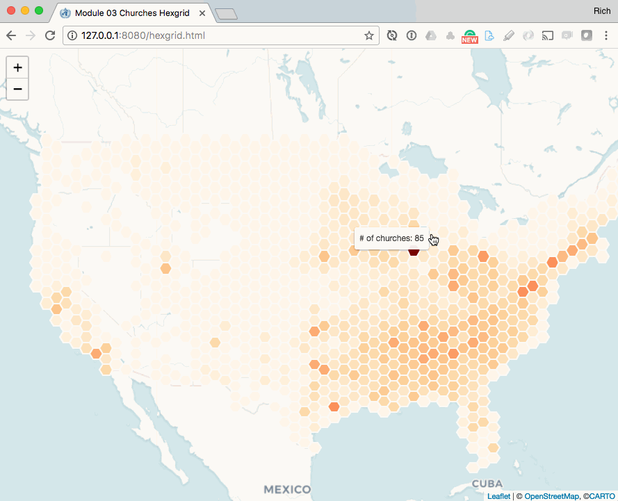  
**Figure 20.** Hexbins created with 2 degrees size.

This map concludes the second part of our lesson on learning about Turf.

#### Deliverable for Part II

1. Be sure you've added and committed the _project-files/churches.json_ file and the _data/hexgrid.json_ files and the completed_hexgrid.html_ file to your project.
2. Then edit and re-run both of the node scripts to produce data and a new hexbin map using a different variable than churches (give the new HTML document a name cooresponding to the mapped variable). See the available feature class names here: https://geonames.usgs.gov/apex/f?p=gnispq:8:0:::::

Congratulations! You've just covered a lot of ground using several demanding web technologies.

Commit all work and push to the repository by the due date.

## Assigment 06: Collaborative Geoprocessing in Turf.js

Rather than working solely with paired team members, your instructor will invite you to collaborate with the entire class using the following repository: [https://github.com/newmapsplus/turf-examples](https://github.com/newmapsplus/turf-examples).

Our goal is to build up and share some examples using Turf with each other. These scripts should be simple and can either be designed to run in the browser (from Part I of Assignment 05) or to use Node on the server (from part II of Assignment 06).

You'll notice that there are already several examples in the repository. These are examples built by the MAP675 class from the Fall of 2017. Feel free to explore these. You may wish to expand upon or improve one as well!

Follow these steps to start the collaborative assignment:

1. Accept the invitation to the repository
2. Clone the repository down to your local machine
3. Create a new branch (name the branch using your GitHub handle)
4. Install npm using `npm install` (will create the **node_modules/** directory)
5. Add, commit, and push minimally 2 example scripts using Turf to accomplish a GIS/mapping task by following these steps:

    a. Create a new directory for each example, named appropriately (e.g., **buffer-points-client/**). As a convention, name the directories using a client solution with **-client** at the end and directories using a Node solution with **-server** at the end (see the [examples](https://github.com/newmapsplus/turf-examples/tree/rgdonohue))
    b. Create a new HTML file (see template below) that loads Turf.js from an external CDN, any example data files, and processes the data in some way (if doing a browser-based example), or
    c. Create a Node script that loads a data file, processes it using Turf, and outputs a GeoJSON file. (see the [examples](https://github.com/newmapsplus/turf-examples/tree/rgdonohue)). Loading this output file into a simple HTML/Leaflet map is a nice way of demonstrating it works, or minimally a screenshot of the output loaded up on geojson.io.

Also, remember it's good practice to do a `git pull` or `git pull origin master` on the master branch before creating your new branch.

See the examples created under the rgdonohue branch (which have also been merged to the master branch): [https://github.com/newmapsplus/turf-examples/tree/rgdonohue](https://github.com/newmapsplus/turf-examples/tree/rgdonohue)

You don't need to build an entire interactive, thematic map for these examples, but instead you should document with code comments in the script and a **README.md** file within the directory what the code accomplishes and what Turf methods it uses.

Use the following template for the HTML examples to get started:

```html
<!doctype html>

<html lang="en">
<head>
  <meta charset="utf-8">

  <title>Turf buffer points example</title>
  <link rel="stylesheet" href="https://unpkg.com/leaflet@1.3.1/dist/leaflet.css" />

  <style>
        body {
            font-family: sans-serif;
            margin: 0;
            padding: 0;
        }
        #map {
            position: absolute;
            width: 100%;
            top: 0;
            bottom: 0;
        }
  </style>

</head>

<body>
        <div id="map"></div>
        <script src="https://code.jquery.com/jquery-3.2.1.min.js"></script>
        <script src="https://unpkg.com/leaflet@1.3.1/dist/leaflet.js"></script>
        <script src='https://npmcdn.com/@turf/turf/turf.min.js'></script>
  <script>

        // create Leaflet map, centered on Texas
        var map = L.map('map', {
            zoomSnap: .1,
            center: [20.8, -7.66],
            zoom: 2
        });

        // add a basemap of tiles
        L.tileLayer('https://cartodb-basemaps-{s}.global.ssl.fastly.net/rastertiles/voyager_nolabels/{z}/{x}/{y}.png', {
            maxZoom: 18, attribution: '&copy; <a href="http://www.openstreetmap.org/copyright">OpenStreetMap</a>, &copy;<a href="https://carto.com/attribution">CARTO</a>'
        }).addTo(map);
  </script>
</body>
</html>
```

Good luck, have fun, and as always email or Slack chat your instructor on Slack with questions or feedback.